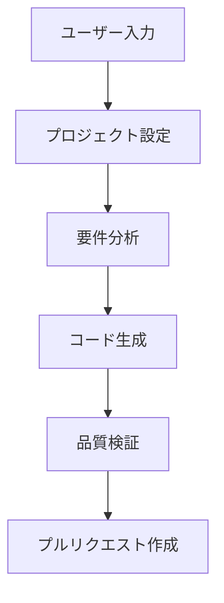

# ワークフロー構造解説

## 概要

この GitHub Actions ワークフローは、Claude Code SDK を使用して AI 駆動で TODO アプリを自動生成するシステムです。

## 📊 全体のフロー図



## 🏗️ ワークフローの構造

### 1. トリガー（開始条件）

**手動実行**: `workflow_dispatch`

- GitHub Actions ページから手動で実行
- アプリ要件とタイプを入力

**Issue 連動**: `issues` + `issue_comment`

- Issue 作成時または Issue コメント時に自動実行
- `@create-todo-app` コマンドで開始

### 2. ジョブ構成（5 つの段階）

#### ジョブ 1: `setup-project` 🌿

**目的**: 新しいブランチを作成して作業環境を準備

```yaml
permissions:
  contents: write # ブランチ作成・ファイル変更権限
```

**実行内容**:

- 日時と run_id を組み合わせたユニークなブランチ名を生成
- 新しいブランチを作成してプッシュ
- 他のジョブで使用するブランチ名とフォルダ名を出力

**出力**:

- `branch-name`: 新しく作成されたブランチ名
- `folder-name`: 生成ファイル用のフォルダ名

---

#### ジョブ 2: `requirements-analysis` 📋

**目的**: ユーザーの要求を分析し、詳細な技術仕様を作成

```yaml
needs: [setup-project] # setup-projectの完了を待つ
permissions:
  contents: write
```

**使用ツール**:

- Claude Code SDK
- `Read`, `Write`, `Edit` ツール

**実行内容**:

1. ユーザー要件とアプリタイプを分析
2. システム分析の専門家として以下を生成：
   - `requirements.md`: 機能要件・非機能要件
   - `technical-spec.md`: 技術仕様書
   - `file-structure.md`: ファイル構造設計
   - `implementation-plan.md`: 実装計画

**重要な制約**:

- 生成ファイル数: 最大 8 個
- 各ファイルサイズ: 500 行以内
- アプリタイプに適した技術スタック選定

**出力**:

- `analysis-completed`: 分析完了フラグ

---

#### ジョブ 3: `code-generation` 💻

**目的**: 要件に基づいて実際のアプリケーションコードを生成

```yaml
needs: [setup-project, requirements-analysis]
permissions:
  contents: write
```

**使用ツール**:

- Claude Code SDK
- `Read`, `Write`, `Edit` ツール

**アプリタイプ別の生成内容**:

**Basic HTML**:

```yaml
FILES: "index.html, style.css, script.js, README.md"
FEATURES:
  - ローカルストレージでデータ永続化
  - レスポンシブデザイン対応
  - モダンなCSS（Flexbox/Grid使用）
  - ES6+のJavaScript使用
```

**React App**:

```yaml
FILES: "src/App.tsx, src/components/, src/hooks/, src/types/, package.json"
FEATURES:
  - TypeScript使用で型安全性確保
  - カスタムフック活用
  - Context API使用
  - Vite設定
```

**Full Stack App**:

```yaml
FILES: "frontend/, backend/, package.json, docker-compose.yml"
FEATURES:
  - REST API設計
  - JWT認証実装
  - MongoDB接続
  - CORS設定
```

**出力**:

- `generation-completed`: 生成完了フラグ

---

#### ジョブ 4: `quality-assurance` 🔍

**目的**: 生成されたコードの品質を検証

```yaml
needs: [setup-project, code-generation]
permissions:
  contents: write
```

**検証内容**:

**Basic HTML 検証**:

- HTML 構造の妥当性チェック
- CSS 構文チェック
- JavaScript 構文チェック（Node.js -c）

**React App 検証**:

- package.json 構文チェック（jq）
- React 依存関係の確認
- TypeScript ファイルの存在確認

**Full Stack App 検証**:

- フロントエンド構造確認
- バックエンド構造確認
- Docker 設定確認

**共通検証**:

- ファイル存在確認
- ファイルサイズチェック
- README.md 確認

**出力**:

- `qa-completed`: 品質検証完了フラグ

---

#### ジョブ 5: `create-pr` 📎

**目的**: 全ての成果物をまとめてプルリクエストを作成

```yaml
needs:
  [setup-project, requirements-analysis, code-generation, quality-assurance]
permissions:
  contents: write
  pull-requests: write
```

**実行内容**:

1. 全成果物の存在確認とファイル数カウント
2. 生成ファイルをコミット
3. アプリタイプ別の使用方法説明を生成
4. GitHub Actions Summary に結果表示
5. プルリクエスト作成（詳細な説明付き）

## 🔧 技術的なポイント

### 並行実行とは？

```yaml
needs: [job1, job2] # job1とjob2の両方が完了してから実行
```

### 権限の意味

```yaml
permissions:
  contents: write # ファイル作成・変更・コミット
  pull-requests: write # プルリクエスト作成
  actions: write # 他のワークフロー実行
  issues: write # Issue読み取り・コメント
```

### 出力の受け渡し

```yaml
# ジョブAで出力
echo "my-value=hello" >> $GITHUB_OUTPUT

# ジョブBで使用
${{ needs.jobA.outputs.my-value }}  # "hello"が取得される
```

### Claude Code SDK の使用

```yaml
npx @anthropic-ai/claude-code \
--allowedTools "Read,Write,Edit" \
--max-turns 20 \
--verbose \
--permission-mode "acceptEdits" \
-p "$PROMPT"
```

## 🎯 AI Agent 設計パターン

### Requirements Analysis Agent 📋

```yaml
ROLE: "あなたはシステム分析の専門家です"
TASK:
  - ユーザー要件の詳細分析
  - 技術仕様書の作成
  - 実装計画の立案
OUTPUT: 4つのドキュメントファイル
```

### Code Generation Agent 💻

```yaml
ROLE: "あなたは経験豊富なフルスタック開発者です"
TASK:
  - 要件書に基づくコード生成
  - アプリタイプ別の最適化
  - 品質の高いコード作成
OUTPUT: 動作するアプリケーション
```

### Quality Assurance Agent 🔍

```yaml
ROLE: "品質検証の専門家"
TASK:
  - 構文チェック
  - ファイル構造確認
  - セキュリティ検証
OUTPUT: 品質レポート
```

## 🚨 よくあるエラーと対策

### 1. Claude Code SDK 実行エラー

**エラー**: `Claude Code CLI execution failed`
**対策**:

- ANTHROPIC_API_KEY の確認
- プロンプトの長さ制限チェック
- 権限設定の確認

### 2. 権限エラー

**エラー**: `Permission denied to create branch`
**対策**:

- リポジトリ設定で "Read and write permissions" を選択
- PAT_TOKEN の権限確認

### 3. 生成ファイル検証エラー

**エラー**: `No files were generated`
**対策**:

- プロンプトの制約条件を確認
- 生成ファイル数の制限を調整
- Claude Code SDK の max-turns を増加

### 4. 品質検証失敗

**エラー**: `JavaScript構文エラー`
**対策**:

- 生成されたコードの手動確認
- プロンプトでの構文チェック指示強化
- エラーハンドリングの改善

## 💡 カスタマイズのヒント

### 異なるアプリタイプを追加する場合

1. `create-todo-app.yml`の`app_type`選択肢に追加
2. `code-generation`ジョブに新しいケースを追加
3. `quality-assurance`ジョブに対応する検証を追加

### プロンプトを調整する場合

```yaml
PROMPT="あなたは[専門分野]の専門家です。
[具体的な指示]
[制約条件]
[出力形式]"
```

### 品質検証を強化する場合

```yaml
- name: 追加品質検証
  run: |
    # ESLint実行
    npx eslint $APP_DIR --ext .js,.jsx,.ts,.tsx

    # セキュリティ検証
    npm audit

    # パフォーマンステスト
    lighthouse $APP_DIR/index.html
```

### 新しいツールを追加する場合

1. `.claude/settings.json`に権限を追加
2. ワークフローの`--allowedTools`に追加
3. プロンプトで使用方法を指示

## 📊 パフォーマンス最適化

### 実行時間の短縮

- プロンプトの簡潔化
- 生成ファイル数の制限
- 並列処理の活用

### リソース使用量の最適化

- ファイルサイズ制限
- メモリ使用量の監視
- 不要なツールの除外

### エラー率の削減

- 詳細なエラーハンドリング
- 段階的な検証
- リトライ機能の実装

## 🔄 Issue 駆動開発の実装

### Issue 解析パターン

```javascript
// 要件抽出
const requirementsMatch = content.match(/要件\s*[：:]\s*(.+?)(?=\n技術|$)/s);

// 技術スタック判定
if (techText.includes("react")) {
  appType = "react-app";
} else if (techText.includes("fullstack")) {
  appType = "fullstack-app";
}
```

### 自動応答システム

```javascript
// 成功時の応答
await github.rest.issues.createComment({
  body: `✅ AI TODO アプリ生成ワークフローがトリガーされました！`,
});

// エラー時の応答
await github.rest.issues.createComment({
  body: `❌ エラーが発生しました。[ログ](${context.serverUrl})`,
});
```

## 🎯 実装時の重要なチェックポイント

### 1. プロンプト設計

- ✅ 具体的な制約条件を明記
- ✅ 生成ファイル数・サイズの制限
- ✅ 技術スタックの明確な指定
- ✅ 出力フォルダの指定

### 2. エラーハンドリング

- ✅ 必須ファイルの存在確認
- ✅ 構文エラーのチェック
- ✅ 再試行機能の実装
- ✅ 失敗時の詳細ログ

### 3. 品質保証

- ✅ 自動テスト機能
- ✅ コード品質チェック
- ✅ セキュリティ検証
- ✅ パフォーマンス確認

### 4. ユーザビリティ

- ✅ 分かりやすいドキュメント
- ✅ 詳細なエラーメッセージ
- ✅ 進行状況の可視化
- ✅ 成果物の明確な説明

この設計パターンを理解することで、他の分野（データ分析、API 開発、インフラ構築等）にも応用可能な強力な AI 駆動ワークフローを構築できます。

---

🤖 **Workflow Architecture Guide** - AI TODO App Generator
